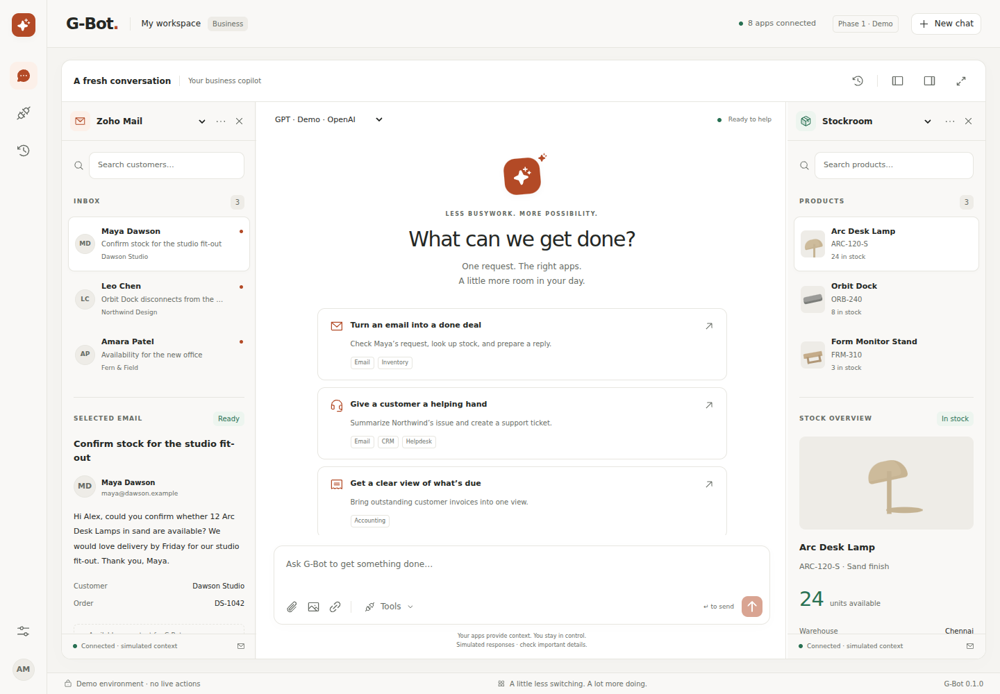

# G-Bot Astra

**Ask once. Work across your business.**

A complete Phase 1 frontend simulation of a configurable AI business workspace. G-Bot stays in the center; business apps sit in optional, resizable side panes. Includes onboarding, multiple BYOK providers, eight business-app slots, chat and attachments, cross-app execution, approvals, activity, plan simulation, and five colors with independent light/dark appearance.



## Run

Requires Node.js 20.9+; Node 22 LTS recommended.

```sh
npm ci
npm run dev
```

Open **http://localhost:3000**. Choose **Explore the demo** for the populated Business workspace, or **Create account** for the complete onboarding journey. Use fictional details and demo keys only.

## Verify and run production

```sh
npm run typecheck
npm test
npm run build
npm start
```

Browser acceptance checks:

```sh
npx playwright install chromium
npm run test:e2e
```

## Engineering documentation

- [Engineering handoff](docs/ENGINEERING_HANDOFF.md) — routes, architecture, walkthroughs, limits and Phase 2 migration
- [Validation record](docs/VALIDATION.md) — build, service tests, browser journeys and visual review
- [Third-party notices](THIRD_PARTY_NOTICES.md)

Stack: Next.js 15 · React 19 · TypeScript · Tailwind CSS v4 · Radix/shadcn primitives · Phosphor Icons · Framer Motion · Zustand · TanStack Query · React Hook Form · Zod.

**All integrations and actions are simulated.** No real AI inference, MCP calls, authentication, billing, email delivery, secure native storage, or desktop installer is implemented in Phase 1.
